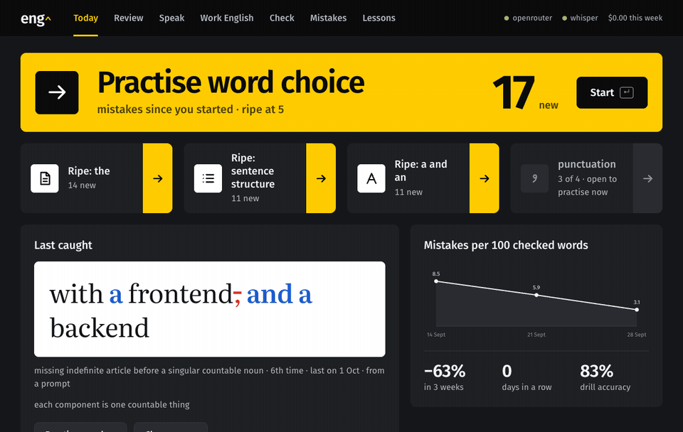
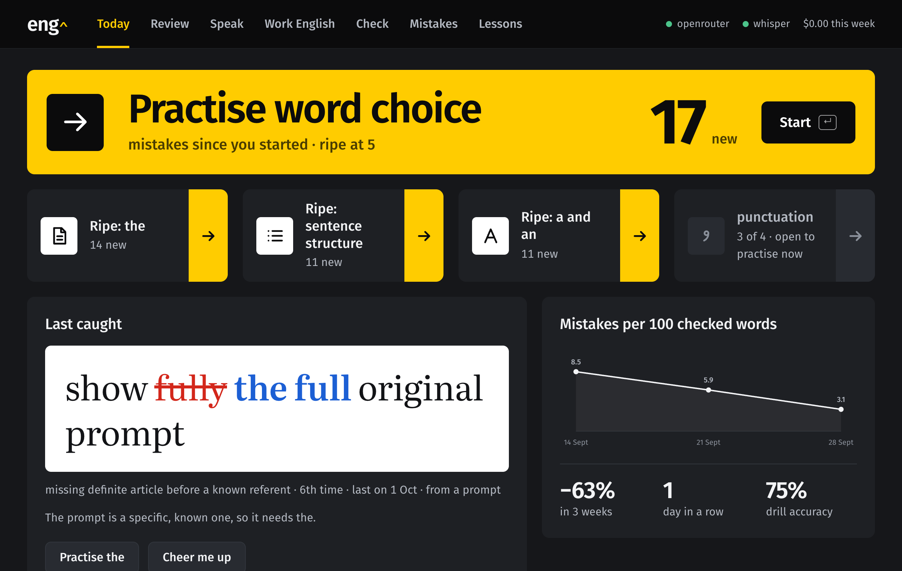
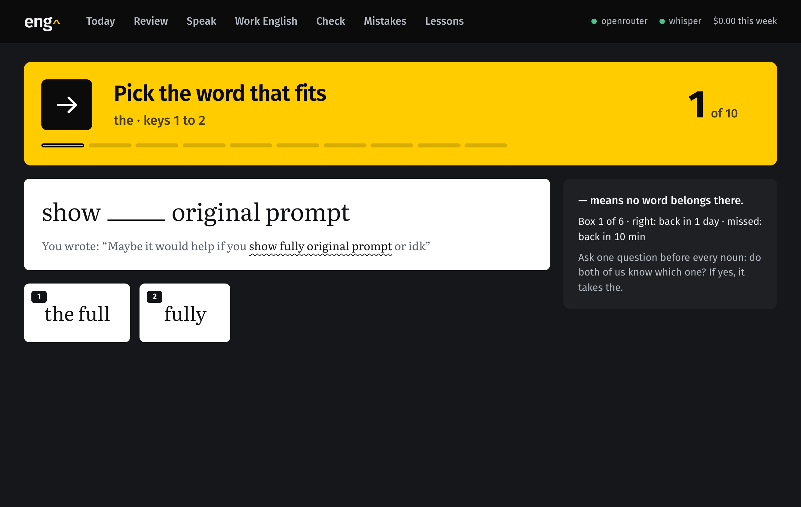
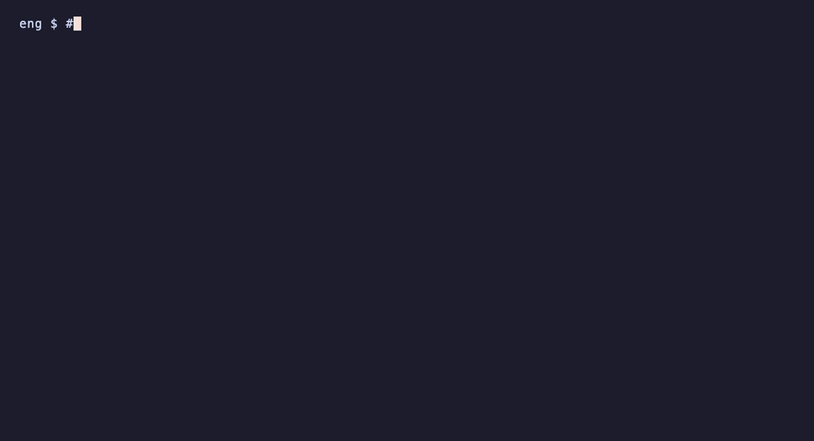

# engimprove

A personal English-learning machine. It catches your mistakes where you already write —
prompts in Claude Code, texts you send for review, spoken answers — stores them in one
append-only database, and drills them back at you as flashcards built from your own phrases:
in the web app, in the terminal, and as a notification when a topic is ripe.

<p align="center">
  
</p>

<table>
  <tr>
    <td></td>
    <td></td>
  </tr>
</table>

<p align="center">
  
</p>

The idea: you already write English all day. Instead of a separate study session, the mistakes
you actually make become the study material, with spaced repetition (Leitner intervals)
deciding what to review and when.

## Quick install via your agent

No time for the manual steps? Copy this prompt into your agent — it performs the whole install
and reports back:

```text
Install engimprove, an English-learning machine for me. Use the engimprove checkout we are
working in, or clone git@github.com:vlle/engimprove.git if there is none (Go 1.22+ required).

1. go build -o bin/eng ./cmd/eng && go test ./...
2. Run bin/eng install. It scaffolds missing data files and registers hooks for Claude Code
   and opencode idempotently; show me its output and fix anything it reports.
3. Ask me for my OpenRouter API key and my native language; set "language" in config/eng.json
   to that language.
4. Run bin/eng doctor and bin/eng status and tell me what still needs my hand.
5. If your agent has no hook surface (e.g. Codex), read the "Agent integration" section of
   README.md and say which manual step you would take; the Check tab of bin/eng open is the
   universal fallback.

Do not hand-edit state/, errors/ or texts/: the mistake database is append-only and written
only through bin/eng log. Finish with a short summary of what was installed and what is left.
```

## How it works

```
english prompt ──► eng hook (async, ~40 ms) ──► state/queue/<ts>.json
                                                │
                          eng check (detached) ◄┘
                          ├─ OpenRouter LLM (or `claude -p` for private roots)
                          ├─ eng log → errors.jsonl, texts/, stats.md
                          └─ state/feedback/<session>.json, state/checks.jsonl
end of turn ──► eng hook-stop ──► "✏️ eng (N): …", "🎯 drills ripe: …", "📈 week …"
                               └─ desktop notification once per cycle
```

- **Topics** (`config/eng.json`): a mistake joins a topic by its category; `the` and `a-an`
  also match on whether the fix adds or removes the article itself. A topic becomes ripe
  when `threshold` fresh mistakes accumulate since the last drill; drilling moves the
  cursor and resets the counter.
- **Cards**: a cloze from the corrected phrase when the gap is guessable — function words
  (a/an/the/—, prepositions, connectors) or a single-word swap with choices; otherwise a
  "fix the phrase" card. The task shows the full original sentence from `texts/` as
  context. LLM-generated packs land in `drills/packs/<topic>.jsonl` (`eng pack generate -topic T`).
- **Repetition**: Leitner system, intervals 10 min / 1 / 3 / 7 / 21 / 60 days; a miss
  sends the card back to the start.
- **Speaking**: the Speak tab records in the browser → ffmpeg → whisper.cpp
  (`models/ggml-small.en.bin`, installed by `eng whisper-setup`) → LLM review → mistakes
  into the same database. Punctuation and transcriber spelling are ignored.
- **Progress**: mistakes per 100 checked words by week (`state/checks.jsonl`), day streak,
  drill accuracy.

## Quick start

Requires Go 1.22+ (stdlib only) and an OpenRouter API key in `OPENROUTER_API` or
`OPENROUTER_API_KEY`. Optional: `claude` CLI as a fallback reviewer, whisper.cpp for speaking.

```sh
git clone git@github.com:vlle/engimprove.git
cd engimprove
go build -o bin/eng ./cmd/eng

bin/eng install    # scaffolds a fresh clone and registers hooks for every agent it finds
bin/eng open       # web app on http://127.0.0.1:7421, starts the server itself
bin/eng status     # which topics are ripe, how many cards are due
bin/eng doctor     # checks OpenRouter, claude, whisper, the server, failed checks
```

What `eng install` does, idempotently — safe to re-run:

- creates what a fresh clone lacks: `errors/errors.jsonl`, a starter `config/eng.json`, `state/`
- Claude Code: appends the `eng hook` / `eng hook-stop` entries to `~/.claude/settings.json`
  (backs it up first, keeps every unrelated entry, rewrites stale paths from a moved checkout)
- opencode: renders `agents/opencode/engimprove.js` with the eng path into
  `~/.config/opencode/plugins/`; restart opencode once to load it
- fish: writes the `eng` wrapper function when `~/.config/fish` exists

Optional shell wrapper so `eng` works from anywhere:

```fish
function eng --description 'engimprove CLI'
    ~/path/to/engimprove/bin/eng $argv
end
```

### Agent integration

The machine catches prompts through two touchpoints, expressed per agent:

| touchpoint | Claude Code | opencode | anything else |
|---|---|---|---|
| prompt capture | `UserPromptSubmit` hook → `eng hook` (stdin json) | plugin `chat.message` → `eng hook -session S -text T` | call `eng hook -text T` from any scripting surface |
| end of turn | `Stop` hook → `eng hook-stop` (stdin json) | plugin `session.idle` → `eng hook-stop -session S` | call `eng hook-stop` when your agent allows an exit hook |

Both CLI hook commands accept `-session`, `-cwd` and `-text` flags as an alternative to the
stdin payload, so other agent runtimes can drive them from any spawn. Agents without hooks
(Codex today) get no automatic capture: instruct the agent through its instructions file to
run `eng hook -text '<user prompt>'` after writing it, or paste English into the Check tab
of the web app (`eng open check`) — same review pipeline, same database.

`eng hook` queues the prompt in ~40 ms without blocking; the detached `eng check` worker
reviews it via OpenRouter and writes the mistakes. `eng hook-stop` prints the feedback line
at the end of the turn — in opencode, where plugins cannot inject a system message, the
feedback arrives as a desktop notification (`eng notify`).

## Commands

| command | what it does |
|---|---|
| `eng open` / `eng serve` | web app / start the server (restart after frontend changes — the static files are embedded in the binary) |
| `eng install` | scaffold a fresh clone, register Claude Code and opencode hooks, fish wrapper |
| `eng status` | ripe topics, due cards, streaks |
| `eng doctor` | health check of every backend |
| `eng check [-retry]` | review queued prompts; retry failed ones |
| `eng log -f <file>` | append mistakes from a JSON file (the only supported way to write to the DB) |
| `eng drill [topic]` | terminal drill |
| `eng pack generate -topic T` | generate an LLM exercise pack for a topic |
| `eng speak review` / `eng speak pending` | review pending speech recordings |
| `eng whisper-setup` | download the whisper.cpp model |

## Configuration — `config/eng.json`

```jsonc
{
  "addr": "127.0.0.1:7421",              // web app address
  "review_threshold": 5,                 // mistakes before a card re-enters review
  "notify": true,                        // desktop notifications
  "whisper_model": "models/ggml-small.en.bin",
  "claude_model": "sonnet",               // `claude -p` fallback
  "openrouter_model": "anthropic/claude-sonnet-5.5",
  "openrouter_env": "",                   // optional: a script that prints `export OPENROUTER_API=…`
  "language": "Russian",                  // the learner's native language: explanations are given in it
  "prompt_style": false,                  // the prompt checker may also log style mistakes (wordiness, register)
  "prompt_translation": false,            // each checked prompt gets a translation + "how it reads" line
  "private_roots": ["~/work"],            // project trees whose prompts never leave for OpenRouter
  "topics": [ /* id, categories, threshold, optional tokens */ ]
```

Any language works: set `language` to the learner's native language and every user-facing
surface follows it — the LLM reviews, explains, and coaches with that language as the
reference point, and the hook feedback lines ("✏️ eng (2): …", "🎯 drills ripe …") and the
`errors/stats.md` header are rendered in it. Everything else — the mistake database,
rules, taxonomy, and the CLI — stays in English. English is the fallback; `internal/i18n`
holds the message packs (Russian and Spanish today, one struct per language to add more).

- Prompts from `private_roots` are reviewed by `claude -p` locally instead of OpenRouter.
- With `prompt_style` the checker also logs style mistakes (kind `style`); they count toward
  the `style` topic like any other mistake. With `prompt_translation` the stop hook also shows
  `🌐 eng: how it reads: … · translation: …`, and the translation is stored in the prompt
  archive in `texts/`. Both flags are off by default: style is subjective, and the extra
  output grows the per-prompt LLM answer.
- Only the prompt text is queued — no pasted content, code, URLs or paths; the queue file
  is deleted after the check. The archive keeps only sentences that contained mistakes
  (plus the translation when `prompt_translation` is on); names and hosts are replaced with `<…>`.
- The API key never goes into the repo: env vars, or an `openrouter_env` fetcher script.
- Checking a prompt via OpenRouter costs about a cent; `claude -p` uses your subscription.

## Data layout

| path | what |
|---|---|
| `errors/errors.jsonl` | mistake database, append-only; write only through `eng log` |
| `errors/taxonomy.md` | the closed list of categories |
| `errors/stats.md` | generated statistics (`scripts/engstats`) |
| `texts/` | archive of reviewed texts and prompts, one file per text |
| `config/eng.json` | address, topic thresholds, models, private roots, notifications |
| `content/lessons.json`, `content/speaking.json` | lessons per topic, speaking questions |
| `drills/packs/` | generated exercise packs |
| `state/` | srs state, answers, sessions, queue, hook feedback, logs |
| `speaking/<id>/` | recording, wav, transcript, review |
| `examples/` | an anonymized sample of the mistake DB and text archive (see its README) |

All of these are gitignored except `errors/taxonomy.md`, `content/` and `examples/`;
a fresh clone fills the rest in on first run.

## Troubleshooting

- Feedback does not appear at the end of a turn → check `state/hook.err`, `state/check.log`,
  `eng doctor`.
- A check failed (network, key) → the prompt sits in `state/queue/failed`;
  `eng check -retry`.
- Changed the frontend → `go build -o bin/eng ./cmd/eng && eng restart` (the static files
  are embedded in the binary). While working on the frontend, `eng restart -static web/static`
  serves it from disk instead: edits show on reload; plain `eng restart` switches back.
- Tests: `go test ./...`.

## Demo recordings

`demo/assets/` holds the GIFs and screenshots above. They run on a throwaway root built from
`examples/` (`scripts/demoroot`), never on live data, with the language set to English.
The end-of-turn corrections in the terminal GIF are seeded, so no LLM call is involved.
Rebuild with `demo/build.sh`; it needs `vhs`, `ffmpeg`, Node and Chrome
(`CHROME=/path/to/chrome` if it is not in `/Applications`).

## Contributing

Issues and PRs are welcome. Keep the taxonomy stable: a new category starts in
`errors/taxonomy.md`, and mistake records are only written through `eng log`.

## License

MIT — see [LICENSE](LICENSE).
